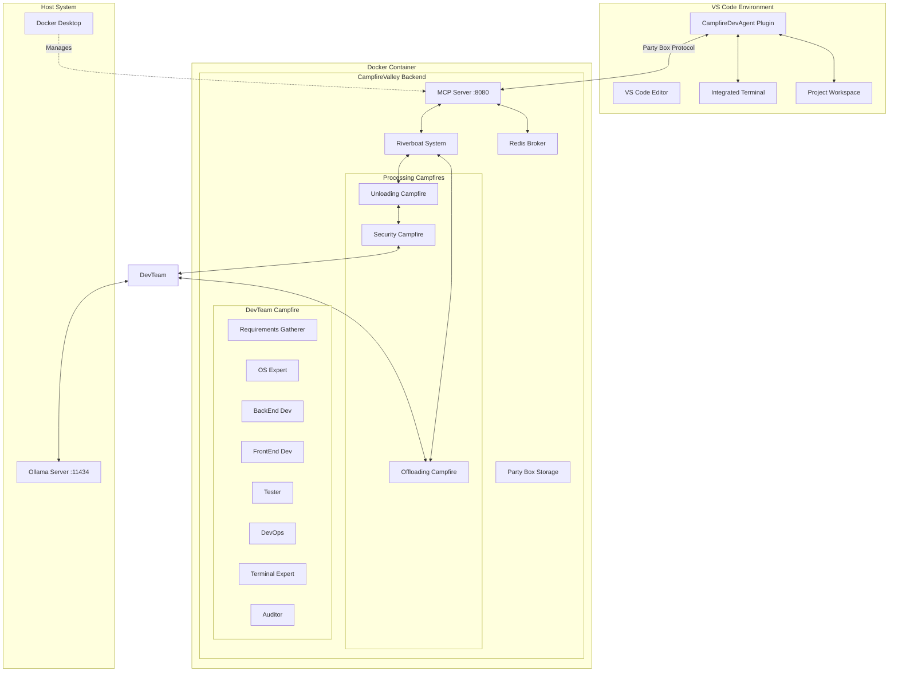

# Design Document

## Overview

The CampfireDevTeam system consists of two main components: a VS Code extension (CampfireDevAgent) and a containerized CampfireValley backend service. The system enables AI-driven development assistance through a collaborative workflow involving specialized AI campers that handle different aspects of software development.

The architecture follows a riverboat-based message passing system where requests flow through security validation, processing by specialized campers, and return delivery of results. All communication uses the Party Box protocol for structured data exchange.

## Architecture

### High-Level Architecture



### Component Interaction Flow

1. **Request Flow**: VS Code Plugin → MCP Server → Riverboat → Unloading → Security → DevTeam → Processing
2. **Response Flow**: DevTeam → Offloading → Riverboat → MCP Server → VS Code Plugin
3. **Bidirectional Commands**: Backend can request actions from Plugin through the same pathway

## Components and Interfaces

### VS Code Plugin (CampfireDevAgent)

#### Core Components

**Command Handler**
- Registers VS Code commands for "Campfire: Generate Code" and "Campfire: Review Code"
- Handles keyboard shortcuts (Ctrl+Shift+P integration)
- Manages command palette integration

**Party Box Manager**
- Creates and validates Party Box payloads according to CampfireValley dock protocol
- Packages file attachments, context information, and task details
- Parses response Party Boxes from the backend
- Handles metadata inclusion (file paths, content types, timestamps)

**Workspace Manager**
- Detects current VS Code workspace root folder
- Configures CampfireValley backend with workspace path
- Monitors workspace changes and updates backend configuration
- Validates file operations within workspace boundaries

**Terminal Interface**
- Executes commands through VS Code's integrated terminal
- Captures command output and error messages
- Detects host operating system and passes to backend
- Handles OS-specific command execution (PowerShell on Windows, bash on Linux/macOS)

**File Operations Manager**
- Creates new code files in appropriate workspace directories
- Handles safe file I/O operations with confirmation for overwrites
- Manages file creation based on file type and project structure
- Supports various file types (Python, JavaScript, HTML, CSS, configuration files)

**Backend Request Handler**
- Responds to directory listing requests from backend
- Provides console output when requested
- Returns specific code sections as requested
- Performs code updates and modifications as directed by backend
- Validates backend requests for security and scope

#### Configuration Schema

```json
{
  "campfire.mcpServer": "http://localhost:8080/mcp",
  "campfire.partyBoxPath": "./party_box",
  "campfire.defaultPrompt": "Build code for {task} on {os}",
  "campfire.workspaceRoot": "/path/to/current/workspace",
  "campfire.osType": "windows|linux|macos"
}
```

#### Party Box Payload Structure

```json
{
  "torch": {
    "claim": "generate_code|review_code|execute_command",
    "task": "Task description",
    "os": "windows|linux|macos",
    "workspace_root": "/path/to/workspace",
    "attachments": [
      {
        "path": "relative/file/path.py",
        "content": "file content",
        "type": "text/python",
        "timestamp": "2025-10-20T21:35:00Z"
      }
    ],
    "context": {
      "current_file": "active_file.py",
      "project_structure": ["file1.py", "dir1/file2.js"],
      "terminal_history": ["last command output"]
    }
  }
}
```

### CampfireValley Backend

#### Docker Configuration

**Dockerfile Structure**
```dockerfile
FROM python:3.12-slim
WORKDIR /app
COPY requirements.txt .
RUN pip install -r requirements.txt
COPY . .
EXPOSE 8080
CMD ["python", "mcp_server.py"]
```

**Docker Compose Configuration**
```yaml
version: '3.8'
services:
  campfire-backend:
    build: .
    ports:
      - "8080:8080"
    volumes:
      - "./party_box:/app/party_box"
    environment:
      - OLLAMA_URL=http://host.docker.internal:11434
      - REDIS_URL=redis://redis:6379
    depends_on:
      - redis
  
  redis:
    image: redis:alpine
    ports:
      - "6379:6379"
```

#### MCP Server Component

**FastAPI Server Structure**
```python
from fastapi import FastAPI, HTTPException
from pydantic import BaseModel
import asyncio

app = FastAPI()

class TorchRequest(BaseModel):
    torch: dict
    workspace_root: str
    os_type: str

@app.post("/mcp")
async def handle_torch(request: TorchRequest):
    # Validate Party Box structure
    # Send to riverboat system
    # Return processed response
    pass
```

#### Campfire Configurations

**DevTeam Campfire Manifest**
```yaml
name: DevTeam
campers:
  - role: RequirementsGatherer
    prompt_template: "Analyze task '{task}' on {os}. Determine scope and requirements."
    
  - role: OSExpert
    prompt_template: "Recommend tech stack for '{task}' on {os} system."
    
  - role: BackEndDev
    prompt_template: "Write backend code for '{task}' using recommended stack."
    
  - role: FrontEndDev
    prompt_template: "Create frontend code for '{task}' with proper integration."
    
  - role: Tester
    prompt_template: "Generate test cases for '{task}' functionality."
    
  - role: DevOps
    prompt_template: "Create deployment scripts for '{task}' on {os}."
    
  - role: TerminalExpert
    prompt_template: "Suggest {os}-specific commands for debugging, logs, Docker, Python execution for '{task}'."
    
  - role: Auditor
    prompt_template: "Audit code for '{task}' - check security, syntax, coverage."
    auditor: true
```

**Processing Campfires**
```yaml
unloading_campfire:
  role: "Unpack Party Box contents and extract file paths, content, task assertions"
  
security_campfire:
  role: "Validate Party Box contents for security compliance"
  
offloading_campfire:
  role: "Package processed results into response Party Box"
```

#### Riverboat System

**Message Flow Handler**
```python
class RiverboatSystem:
    async def receive_party_box(self, party_box: dict):
        # Route to unloading campfire
        unpacked = await self.unloading_campfire.process(party_box)
        
        # Security validation
        validated = await self.security_campfire.validate(unpacked)
        
        if validated['secure']:
            # Route to DevTeam
            result = await self.devteam_campfire.process(validated)
            
            # Package response
            response = await self.offloading_campfire.package(result)
            return response
        else:
            raise SecurityException("Party Box failed security validation")
```

## Data Models

### Party Box Structure

```python
from pydantic import BaseModel
from typing import List, Optional, Dict, Any
from datetime import datetime

class Attachment(BaseModel):
    path: str
    content: str
    type: str
    timestamp: datetime

class Context(BaseModel):
    current_file: Optional[str]
    project_structure: List[str]
    terminal_history: List[str]

class Torch(BaseModel):
    claim: str  # generate_code, review_code, execute_command
    task: str
    os: str
    workspace_root: str
    attachments: List[Attachment]
    context: Context

class PartyBox(BaseModel):
    torch: Torch
    metadata: Dict[str, Any]
```

### Camper Response Structure

```python
class CamperResponse(BaseModel):
    camper_role: str
    response_type: str  # code, suggestion, command, error
    content: str
    files_to_create: List[Dict[str, str]]
    commands_to_execute: List[str]
    confidence_score: float
```

### Backend Request Structure

```python
class BackendRequest(BaseModel):
    action: str  # list_directory, get_console, get_code_section, update_code
    parameters: Dict[str, Any]
    target_path: Optional[str]
```

## Error Handling

### VS Code Plugin Error Handling

**Network Errors**
- Connection timeout to MCP server
- Retry mechanism with exponential backoff
- Fallback to offline mode with cached responses

**File Operation Errors**
- Permission denied for file creation/modification
- Invalid file paths or workspace boundaries
- Disk space limitations

**Party Box Validation Errors**
- Malformed payload structure
- Missing required fields
- Invalid file attachments

### Backend Error Handling

**Security Validation Failures**
- Malicious code detection
- Path traversal attempts
- Unauthorized file access

**Camper Processing Errors**
- Ollama server unavailable
- Model inference failures
- Resource exhaustion

**Docker Container Errors**
- Container startup failures
- Volume mounting issues
- Network connectivity problems

### Error Response Format

```json
{
  "error": {
    "code": "SECURITY_VALIDATION_FAILED",
    "message": "Party Box contains potentially malicious content",
    "details": {
      "validation_step": "security_campfire",
      "rejected_content": "file_path_traversal_attempt"
    },
    "retry_possible": false
  }
}
```

## Testing Strategy

### VS Code Plugin Testing

**Unit Tests**
- Party Box payload creation and validation
- Configuration management
- File operation safety checks
- OS detection accuracy

**Integration Tests**
- MCP server communication
- Terminal command execution
- Workspace detection and configuration
- Backend request handling

**Mock Testing**
- Mock MCP server responses for offline testing
- Simulated backend requests for bidirectional communication
- File system operation mocking

### Backend Testing

**Campfire Testing**
- Individual camper response validation
- Camper collaboration workflow
- Auditor security checks

**Riverboat System Testing**
- Party Box routing accuracy
- Security validation effectiveness
- Response packaging integrity

**Docker Integration Testing**
- Container startup and configuration
- Volume mounting and persistence
- Network connectivity to Ollama and Redis

### End-to-End Testing

**Workflow Testing**
- Complete request/response cycle
- File creation and modification workflows
- Terminal command execution flows
- Error handling and recovery

**Performance Testing**
- Response time under 1 second for small tasks
- Concurrent request handling
- Resource utilization monitoring

### Test Data Management

**Sample Party Boxes**
- Valid request examples for each camper
- Invalid payloads for security testing
- Edge cases for error handling

**Mock Responses**
- Ollama model responses
- Redis broker messages
- File system operations